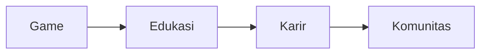
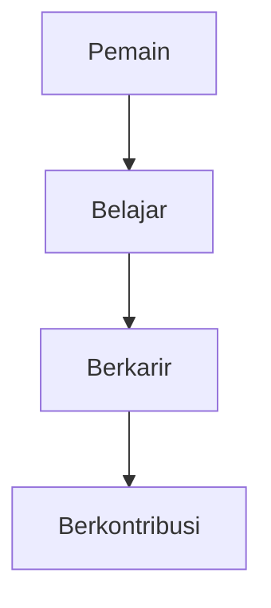
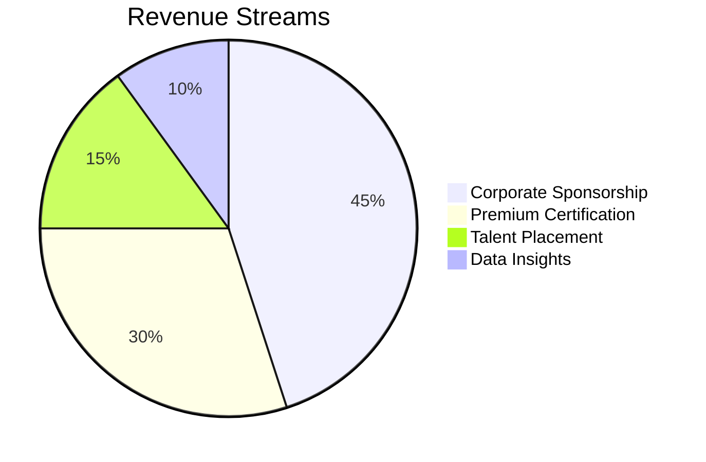

# Executive Brief CitaMaya  
*(Rev. May 2025 - Hybrid Indie Edition)*

## Positioning
**"Indie Edu-Game Studio"** yang menghadirkan:
- Game RPG dengan mekanika belajar alami
- Skala kecil berkelanjutan (5-10 tim inti)
- Monetisasi etis tanpa kompromi kualitas

## Business Model Canvas
| Elemen | Deskripsi |
|--------|-----------|
| **Value Propositions** | Game RPG dengan validasi kompetensi nyata |
| **Customer Segments** | Pekerja upskill (18-35th), perusahaan pencari talent |
| **Channels** | Web/PWA, komunitas edukasi, korporasi |
| **Customer Relationships** | Guild system, mentorship, sertifikasi |
| **Revenue Streams** | Sponsorship jalur, premium cert, talent placement |
| **Key Resources** | Engine game, konten edukasi, jaringan industri |
| **Key Activities** | Pengembangan game, kurasi konten, validasi kompetensi |
| **Key Partnerships** | Kampus, perusahaan, content creator |
| **Cost Structure** | Server, tim kecil, konten |

## Executive Summary
CitaMaya adalah indie game studio yang menciptakan pengalaman:
- Pembelajaran berbasis kompetensi
- Kebutuhan talent industri
- Peluang karir nyata

## Value Proposition Matrix
| Stakeholder | Manfaat Utama | Metrik Sukses |
|-------------|---------------|---------------|
| Perusahaan | Rekrutmen berbasis skill | 40% penurunan biaya hiring |
| Institusi | Kurikulum relevan industri | 30% peningkatan employability |
| Investor | Pertumbuhan pasar edtech | 5x ROI dalam 3 tahun |
| Pemerintah | Penyediaan SDM kompeten | Penurunan pengangguran terdidik |

## Market Opportunity
**Indonesia EdTech Landscape**:
- Total Market: $3.2B (2025)
- Growth Rate: 22% YoY
- User Base: 4.1M MAU

**TAM (Total Addressable Market)**:
- 87M pekerja perlu upskilling
- 12M mahasiswa & fresh graduate
- 5.000+ perusahaan potensial

## Business Model

## Product Differentiation
1. **99 Jalur Belajar** - Coverage terlengkap
2. **Sistem Reputasi** - Verifikasi kompetensi
3. **Ekosistem Terintegrasi** - Pendidikan ke karir
4. **Monetisasi Etis** - Tanpa pay-to-win

## Traction & Milestones
- 15.000+ registered users (beta)
- 3 corporate partners onboarded
- 5 educational institutions collaboration
- 82% completion rate (vs 45% industry avg)

## Financial Projections
| Year | Revenue (Rp M) | Users | Gross Margin |
|------|----------------|-------|-------------|
| 2025 | 4.2 | 50.000 | 65% |
| 2026 | 12.5 | 150.000 | 70% |
| 2027 | 28.8 | 500.000 | 75% |

## Partnership Roadmap
1. **Phase 1 (2025)** - Proof of Concept
   - 10 corporate partners
   - 5 institutional partners
2. **Phase 2 (2026)** - Scaling
   - Nasional coverage
   - ASEAN expansion
3. **Phase 3 (2027)** - Market Leadership
   - Vertical integration
   - AI-powered matching

## Why Invest Now?
1. **Timing** - Pasar edtech Indonesia belum jenuh
2. **Regulation** - Dukungan pemerintah untuk upskilling
3. **Technology** - Infrastruktur digital sudah matang
4. **Demand** - Kesenjangan skill di industri 4.0

## Testimonials
> "Platform ini mengubah cara kami merekrut talent digital dengan cost 60% lebih efisien."
> **- Director of HR, GoTo Financial**

> "Kolaborasi konten dengan CitaMaya meningkatkan relevansi kurikulum kami."
> **- Rektor Universitas Bina Nusantara**

## Next Steps
1. **Discovery Meeting** - Diskusi kebutuhan spesifik
2. **Product Demo** - Lihat platform langsung
3. **Pilot Proposal** - Rencana implementasi
4. **Partnership Agreement** - Mulai kolaborasi

**Contact**: partnerships@citamaya.id | +62 21-12345678
