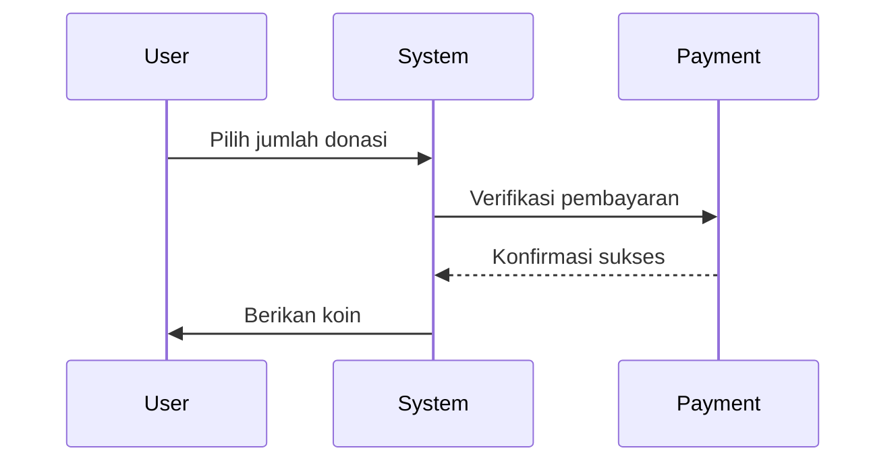

# Desain Game CitaMaya

## Core Gameplay (Text-based MMORPG Edukasi)
**Inspirasi**: 
- Gameplay & UI: Torn (text-based MMORPG)
- Assessment: Duolingo/Codecademy  
- Interaksi: Discord

**Loop Utama**:
1. **Pemilihan Jalur**:
   - **99 Jalur Belajar**:
     * Format text-based
     * Pilihan via command
   
   **1. Teknologi**:
   1. Teknologi Maritim
   2. Teknologi Pertanian
   3. Teknologi Konstruksi
   4. Robotika
   5. Kecerdasan Buatan
   6. Blockchain
   7. Internet of Things
   8. Teknologi Transportasi
   9. Teknologi Material
   10. Teknologi Kedirgantaraan
   11. Teknologi Nuklir

   **2. Bisnis & Ekonomi**:
   1. Manajemen Startup
   2. Fintech
   3. E-commerce
   4. Ekonomi Digital
   5. Manajemen Rantai Pasok
   6. Pemasaran Digital
   7. Analisis Bisnis
   8. Manajemen Keuangan
   9. Kewirausahaan Sosial
   10. Ekonomi Kreatif
   11. Bisnis Internasional

   **3. Lingkungan & Energi**:
   1. Energi Terbarukan
   2. Teknologi Lingkungan
   3. Pengelolaan Sampah
   4. Konservasi Alam
   5. Teknologi Air Bersih
   6. Manajemen Bencana
   7. Arsitektur Hijau
   8. Ekonomi Sirkular
   9. Kebijakan Lingkungan
   10. Teknologi Kelautan
   11. Pertanian Berkelanjutan

   **4. Kesehatan & Biotech**:
   1. Teknologi Medis
   2. Farmasi Modern
   3. Bioteknologi
   4. Kesehatan Digital
   5. Gizi & Dietetika
   6. Biomedis
   7. Kesehatan Masyarakat
   8. Genetika
   9. Neuroteknologi
   10. Teknologi Laboratorium
   11. Manajemen Rumah Sakit

   **5. Sosial & Humaniora**:
   1. Psikologi Industri
   2. Komunikasi Digital
   3. Pengembangan Masyarakat
   4. Hubungan Internasional
   5. Sosiologi Digital
   6. Antropologi Budaya
   7. Filsafat Teknologi
   8. Studi Perdamaian
   9. Manajemen Konflik
   10. Kebijakan Sosial
   11. Filantropi Digital

   **6. Pendidikan**:
   1. Teknologi Pendidikan
   2. Manajemen Sekolah
   3. Pengembangan Kurikulum
   4. Pendidikan Inklusif
   5. E-learning
   6. Psikologi Pendidikan
   7. Pendidikan Karakter
   8. Literasi Digital
   9. Pendidikan Vokasi
   10. Pendidikan Lingkungan
   11. Manajemen Talent

   **7. Seni & Kreatif**:
   1. Desain Digital
   2. Animasi
   3. Game Design
   4. Musik Digital
   5. Film & Media
   6. Seni Rupa Digital
   7. Creative Writing
   8. Desain Produk
   9. Fashion Tech
   10. Arsitektur Digital
   11. Seni Pertunjukan

   **8. Hukum & Kebijakan**:
   1. Hukum Teknologi
   2. Kebijakan Digital
   3. Hukum Bisnis
   4. Hukum Internasional
   5. Cyber Law
   6. Hukum Kesehatan
   7. Hukum Lingkungan
   8. Kebijakan Publik
   9. Hukum Hak Cipta
   10. Hukum Keuangan
   11. Mediasi & Arbitrase

   **9. Pertahanan & Keamanan**:
   1. Keamanan Siber
   2. Intelijen Strategis
   3. Manajemen Bencana
   4. Keamanan Maritim
   5. Teknologi Pertahanan
   6. Diplomasi Keamanan
   7. Forensik Digital
   8. Manajemen Krisis
   9. Keamanan Energi
   10. Keamanan Pangan
   11. Anti-Terorisme

   - Setiap jalur memiliki 10 level kompetensi
   - Pemilih bebas ganti jalur kapan saja
   - 3 jalur awal terbuka, sisanya perlu diunlock

2. **Proses Belajar**:
   - Setiap level terdiri dari:
     * Materi teks (~1200 kata)
     * Video pendukung (embed YouTube)
     * Referensi eksternal
   - Sistem penyelesaian mandiri

3. **Assessment**:
   - Kuis 5-10 soal per level
   - Passing grade 70%
   - 3 kali kesempatan mencoba

4. **Progresi**:
   - XP untuk setiap level selesai
   - Unlock karir terkait
   - Badge dan achievement

## Sistem Karir

### Struktur Karir per Lembaga:
1. **Lembaga Negara**:
   - Pemula: Staf Junior (100 cita/bulan)
   - Menengah: Koordinator (250 cita/bulan)
   - Ahli: Kepala Divisi (500 cita/bulan)

2. **Organisasi Swasta**:
   - Pemula: Volunteer (50 cita/bulan)
   - Menengah: Project Officer (150 cita/bulan)
   - Ahli: Program Director (350 cita/bulan)

3. **Perusahaan**:
   - Pemula: Intern (75 cita/bulan)
   - Menengah: Specialist (200 cita/bulan)
   - Ahli: Senior Manager (450 cita/bulan)

### Persyaratan Promosi:
1. **Keahlian**:
   - Minimal 3 study path terkait
   - Level kompetensi sesuai jenjang

2. **Reputasi**:
   - Minimal 100 poin untuk Menengah
   - Minimal 300 poin untuk Ahli

3. **Proyek**:
   - Menyelesaikan 2 proyek kecil (untuk Menengah)
   - Memimpin 1 proyek besar (untuk Ahli)

### Benefit Karir:
- **Virtual**:
  - Akses fasilitas eksklusif
  - Hak voting di lembaga
  - Bonus prestasi

- **Dunia Nyata**:
  - Rekomendasi kerja
  - Akses pelatihan premium
  - Jaringan profesional

### Sistem Kompensasi:
1. Gaji virtual bisa digunakan untuk:
   - Upgrade alat kerja
   - Pelatihan tambahan
   - Investasi bisnis in-game

2. Bonus kinerja:
   - Berdasarkan KPI bulanan
   - Sistem bagi hasil proyek
   - Reward khusus inisiatif

## Konten Pembelajaran
### Struktur:
- **Maritim**:
  1. Dasar Navigasi
  2. Manajemen Pelabuhan
  3. Teknologi Kapal
  4. Logistik Maritim
  5. Kebijakan Kelautan

- **Energi Hijau**:
  1. Dasar Energi Terbarukan
  2. Teknologi Solar
  3. Manajemen Grid
  4. Kebijakan Energi
  5. Ekonomi Hijau

## Sistem Institusi
### Kampus & Lembaga:
- **Afiliasi Utama**:
  1. Nusantara ↔ Lembaga Ilmu Pengetahuan
  2. Dwipantara ↔ Badan Ekonomi Kreatif
  3. Giri Samudra ↔ Kementerian Maritim
  4. Rimba Hijau ↔ Yayasan Hijau Lestari
  5. Laut Biru ↔ Asosiasi Fintech Indonesia
  6. Gunung Megah ↔ LSM Pendidikan Nusantara
  7. Logika ↔ Nusatech
  8. Etika ↔ Mitra Hukum Indonesia
  9. Estetika ↔ Kreasi Desain Nusantara

- **Karir Path**:
  - Setiap lembaga memiliki 3 jenjang karir (Pemula-Menengah-Ahli)
  - Persyaratan masuk berdasarkan:
    * Study path yang diselesaikan
    * Level kompetensi
    * Reputasi kampus

- **Institusi Player-Made**:
  - Bisa didirikan mulai level 5
  - Sistem akreditasi berbasis prestasi alumni
  - Bisa menjadi mitra lembaga existing

## Ekonomi Game

### Sistem Donasi
1. **Konversi Koin**:
   - Rp 10.000 = 5 koin
   - Maksimal Rp 200.000/minggu (100 koin)

2. **Penggunaan Koin**:
   - Hanya untuk:
     * Kosmetik karakter
     * Customisasi profil  
     * Akses event khusus
   - Tidak mempengaruhi:
     * Progres game
     * Sistem penilaian

3. **Transparansi**:
   - Laporan bulanan penggunaan dana
   - Audit independen tahunan
   - Opsi donasi ke institusi mitra

### Mata Uang Virtual (cita):
   - Tidak bisa diuangkan/ditukar ke mata uang nyata
   - Transfer antar pemain maksimal 50 cita/bulan
   - Biaya transfer 5% (untuk mencegah eksploitasi)

2. **Monetisasi**:
   - Pembelian koin maksimal 100 cita/minggu
   - Hanya untuk kosmetik & fitur non-esensial
   - Sponsor edukasi (non-intrusif)

3. **Kebijakan Legal**:
   - Koin cita bukan aset finansial
   - Tidak ada nilai tukar resmi
   - Tidak diakui sebagai alat pembayaran
   - Dilarang diperjualbelikan

4. **Anti Exploit**:
   - Sistem deteksi transaksi mencurigakan
   - Audit otomatis tiap transaksi
   - Pembekuan akun untuk pelanggaran

## Struktur Institusi

### 9 Kampus Default:
1. **Negeri**:
   - Nusantara (Teknologi & Engineering)
   - Dwipantara (Bisnis & Ekonomi)
   - Giri Samudra (Maritim & Energi)

2. **Swasta Yayasan**:
   - Rimba Hijau (Lingkungan & Kehutanan)
   - Laut Biru (Kelautan & Perikanan)
   - Gunung Megah (Pertanian & Geologi)

3. **Swasta Perusahaan**:
   - Logika (AI & Digital)
   - Etika (Hukum & Kebijakan)
   - Estetika (Seni & Desain)

### 9 Lembaga Karir:
1. **Lembaga Negara**:
   - Kementerian Maritim
   - Badan Ekonomi Kreatif
   - Lembaga Ilmu Pengetahuan

2. **Organisasi Swasta**:
   - Yayasan Hijau Lestari
   - Asosiasi Fintech Indonesia
   - LSM Pendidikan Nusantara

3. **Perusahaan**:
   - Nusatech
   - Mitra Hukum Indonesia
   - Kreasi Desain Nusantara

### Sistem Afiliasi:
- Setiap kampus memiliki 1 lembaga utama terkait
- Pemain bisa bekerja di lembaga setelah menyelesaikan study path terkait
- Sistem rekomendasi berdasarkan prestasi akademik

## Sistem Kolaborasi Antar Kampus

### Mekanisme Kolaborasi:
1. **Transfer Kredit**:
   - Maksimal 2 mata kuliah/semester di kampus lain
   - Konversi nilai otomatis berdasarkan equivalensi
   - Persyaratan: Reputasi Level 3+ di kampus asal

2. **Projek Bersama**:
   - Tim terdiri dari 3-5 pemain beda kampus
   - Sistem reputasi tim dan individu
   - Hadiah khusus untuk projek kolaborasi

3. **Mentorship**:
   - Pemain level tinggi bisa menjadi mentor lintas kampus
   - Sistem reward berdasarkan keberhasilan mentee

### Persyaratan Kolaborasi:
- Minimal menyelesaikan 3 jalur di kampus asal
- Reputasi minimal 50 poin
- Tidak dalam masa sanksi akademik

## Sistem Kredit & Sertifikasi

### Struktur Kredit:
- 1 modul belajar = 1 SKS virtual
- Kelulusan butuh 144 SKS (120 SKS utama + 24 SKS pilihan)
- Kredit kolaborasi diakui maksimal 30% total

### Verifikasi Sertifikat:
1. **Digital Signature**:
   - Tanda tangan digital institusi
   - Hash kriptografi unik

2. **QR Code System**:
   - Kode unik terhubung database
   - Validasi real-time via API

3. **Tingkatan Sertifikat**:
   - Dasar (Level 1-3)
   - Menengah (Level 4-7)
   - Ahli (Level 8-10)

## Mapping Study Path per Kampus

### 1. Nusantara (Teknologi & Engineering)
- **8 Jalur Utama**:
  1. Teknologi Maritim
  2. Robotika
  3. Internet of Things
  4. Teknologi Transportasi
  5. Teknologi Material
  6. Teknologi Kedirgantaraan
  7. Teknologi Nuklir
  8. Teknologi Konstruksi

- **2 Jalur Kolaborasi**:
  1. Teknologi Medis (dengan Kampus Kesehatan)
  2. Smart Agriculture (dengan Gunung Megah)

- **1 Jalur Khusus**:
  Smart City (Nusantara + Etika + Dwipantara)

### 2. Dwipantara (Bisnis & Ekonomi)
- **8 Jalur Utama**:
  1. Manajemen Startup
  2. Fintech
  3. E-commerce
  4. Ekonomi Digital
  5. Manajemen Rantai Pasok
  6. Pemasaran Digital
  7. Analisis Bisnis
  8. Kewirausahaan Sosial

- **2 Jalur Kolaborasi**:
  1. Bisnis Kreatif (dengan Estetika)
  2. Hukum Bisnis (dengan Etika)

- **1 Jalur Khusus**:
  Ekonomi Biru (Dwipantara + Giri Samudra + Rimba Hijau)

### 3. Giri Samudra (Maritim & Energi)
- **8 Jalur Utama**:
  1. Energi Terbarukan
  2. Teknologi Kelautan
  3. Manajemen Pelabuhan
  4. Logistik Maritim
  5. Kebijakan Kelautan
  6. Teknologi Kapal
  7. Konservasi Laut
  8. Energi Oseanik

- **2 Jalur Kolaborasi**:
  1. Energi Hijau (dengan Rimba Hijau)
  2. Hukum Maritim (dengan Etika)

- **1 Jalur Khusus**:
  Ekosistem Pesisir (Giri Samudra + Laut Biru + Rimba Hijau)

### 4. Rimba Hijau (Lingkungan & Kehutanan)
- **8 Jalur Utama**:
  1. Pengelolaan Sampah
  2. Konservasi Alam
  3. Teknologi Air Bersih
  4. Arsitektur Hijau
  5. Ekonomi Sirkular
  6. Kebijakan Lingkungan
  7. Pertanian Berkelanjutan
  8. Manajemen Bencana

- **2 Jalur Kolaborasi**:
  1. Agroforestri (dengan Gunung Megah)
  2. Ekowisata (dengan Estetika)

- **1 Jalur Khusus**:
  Restorasi Ekosistem (Rimba Hijau + Laut Biru + Nusantara)

### 5. Laut Biru (Kelautan & Perikanan)
- **8 Jalur Utama**:
  1. Teknologi Perikanan
  2. Budidaya Laut
  3. Bioteknologi Kelautan
  4. Penginderaan Jauh Kelautan
  5. Ekonomi Maritim
  6. Konservasi Pesisir
  7. Teknologi Akuakultur
  8. Kebijakan Perikanan

- **2 Jalur Kolaborasi**:
  1. Bioteknologi Pangan (dengan Gunung Megah)
  2. Hukum Kelautan (dengan Etika)

- **1 Jalur Khusus**:
  Kota Pesisir Cerdas (Laut Biru + Logika + Giri Samudra)

### 6. Gunung Megah (Pertanian & Geologi)
- **8 Jalur Utama**:
  1. Smart Farming
  2. Agroteknologi
  3. Geologi Pertanian
  4. Teknologi Pangan
  5. Manajemen Lahan
  6. Hortikultura Modern
  7. Teknologi Benih
  8. Geofisika Terapan

- **2 Jalur Kolaborasi**:
  1. Pertanian Digital (dengan Logika)
  2. Agroindustri (dengan Dwipantara)

- **1 Jalur Khusus**:
  Ketahanan Pangan (Gunung Megah + Rimba Hijau + Nusatech)

### 7. Logika (AI & Digital)
- **8 Jalur Utama**:
  1. Kecerdasan Buatan
  2. Blockchain
  3. Data Science
  4. Cybersecurity
  5. Cloud Computing
  6. Machine Learning
  7. Computer Vision
  8. Natural Language Processing

- **2 Jalur Kolaborasi**:
  1. Digital Forensik (dengan Etika)
  2. Creative Coding (dengan Estetika)

- **1 Jalur Khusus**:
  Metaverse Development (Logika + Estetika + Nusantara)

### 8. Etika (Hukum & Kebijakan)
- **8 Jalur Utama**:
  1. Hukum Teknologi
  2. Kebijakan Digital
  3. Hukum Bisnis
  4. Hukum Internasional
  5. Cyber Law
  6. Hukum Lingkungan
  7. Kebijakan Publik
  8. Mediasi & Arbitrase

- **2 Jalur Kolaborasi**:
  1. Etika AI (dengan Logika)
  2. Kebijakan Pendidikan (dengan LSM Pendidikan Nusantara)

- **1 Jalur Khusus**:
  Tata Kelola Digital Nasional (Etika + Logika + Dwipantara)

### 9. Estetika (Seni & Desain)
- **8 Jalur Utama**:
  1. Desain Digital
  2. Animasi
  3. Game Design
  4. Musik Digital
  5. Film & Media
  6. Creative Writing
  7. Fashion Tech
  8. Arsitektur Digital

- **2 Jalur Kolaborasi**:
  1. Desain Produk (dengan Logika)
  2. Seni Pertunjukan (dengan Yayasan Hijau Lestari)

- **1 Jalur Khusus**:
  Ekosistem Kreatif (Estetika + Kreasi Desain Nusantara + Dwipantara)

## Integrasi Dunia Nyata
1. **Sertifikasi**:
   - Badge digital yang diakui industri
   - Rekomendasi untuk magang/kerja
   
2. **Jaringan Alumni**:
   - Forum diskusi profesional
   - Event karir hybrid
   - Mentorship program
