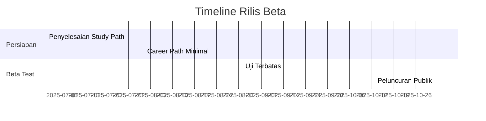
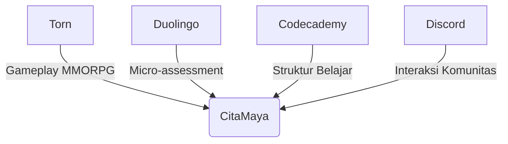

# Visi Proyek CitaMaya

## Misi & Tujuan
Membangun platform pendidikan berbasis game yang:
- Menyediakan akses belajar alternatif bagi yang terkendala pendidikan formal
- Mengemas pembelajaran sebagai pengalaman game yang menyenangkan
- Menghubungkan kompetensi virtual dengan kesempatan karir nyata

## Filosofi Inti
"Belajar Tanpa Sadar Belajar" - Transformasi pembelajaran melalui:
- Sistem quest dengan materi edukasi terselubung
- Progresi berbasis kompetensi riil
- Interaksi sosial yang mendukung belajar

## Nilai Dasar
1. **Inklusivitas**:
   - Gratis untuk 72 jalur utama
   - Akses web/PWA tanpa batas
   - Fleksibel belajar lintas kampus

2. **Relevansi Industri**:
   - 99 jalur dalam 9 bidang strategis:
     * Teknologi (AI, Robotika, IoT)
     * Bisnis (Startup, Fintech, E-commerce)  
     * Lingkungan (Energi Terbarukan, Konservasi)
     * Kesehatan (Biotek, Teknologi Medis)
   - Kurikulum dikembangkan dengan industri:
     * 9 lembaga mitra utama
     * Sertifikasi diakui pasar kerja

3. **Ekonomi Game yang Sehat**:
   - Monetisasi etis:
     * Kosmetik & fitur non-esensial
     * Batasan transaksi (100 koin/minggu)
     * Sponsor edukasi tanpa iklan intrusif
   - Anti pay-to-win:
     * Semua jalur belajar bisa diselesaikan gratis
     * Keunggulan murni berdasarkan skill

## Rencana Rilis Beta

## Komitmen Kualitas
1. **Konten Lengkap**:
   - 99 Study Path tersedia sejak beta
   - 3 Career Path utama (Teknologi, Bisnis, Pendidikan)
   - Sistem assessment dasar

2. **Model Berkelanjutan**:
   - Tim kecil 5-10 orang
   - Biaya operasional < Rp 15jt/bulan
   - Break-even target 12 bulan

## Target Pengguna
### Profil Utama:
- Pekerja yang ingin upskill
- Pencari kerja tanpa akses kampus  
- Pelajar non-formal
- Umur 18-35 tahun

### Platform:
- Web-based dengan PWA mobile
- Konten dari open course + kerjasama
- Assessment AI via OpenRouter API

## Inspirasi & Komparasi Platform

**Detail Pengaruh**:
1. **Dari Torn**:
   - Mekanika text-based MMORPG
   - Sistem guild dan quest
   - Progresi karakter mendalam

2. **Dari Duolingo**:
   - Pembelajaran berbasis micro-lesson
   - Instant feedback system
   - Adaptive difficulty

3. **Dari Codecademy**:
   - Learning path terstruktur
   - Hands-on practice
   - Skill certification

4. **Dari Discord**:
   - Server komunitas tematik
   - Voice/text channels
   - Kolaborasi real-time

**Tabel Perbandingan**:
| Aspek          | Torn  | Duolingo | Codecademy | Discord | CitaMaya |
|----------------|-------|----------|------------|---------|----------|
| Game Mechanics | ★★★★★ | ★★☆☆☆    | ★★☆☆☆      | ★☆☆☆☆   | ★★★★★    |
| Edu Structure  | ★☆☆☆☆ | ★★★★☆    | ★★★★★      | ★☆☆☆☆   | ★★★★★    |
| Social Features| ★★★★★ | ★★☆☆☆    | ★★☆☆☆      | ★★★★★   | ★★★★☆    |
| Career Path    | ★☆☆☆☆ | ★☆☆☆☆    | ★★★☆☆      | ★☆☆☆☆   | ★★★★★    |

**Nilai Unik CitaMaya**:
- Synergi sempurna antara:
  - Kedalaman game Torn
  - Sistem belajar Duolingo
  - Kurikulum Codecademy
  - Interaksi Discord
